# Hey there, I'm mggyslz 👋
### Full-Stack Developer & Code Artist · Bicol Region, Philippines 🇵🇭

 

---

## 💡 About Me

I'm a **Full-Stack Developer & Code Artist** focused on designing and building reliable, well-structured solutions. My work centers on deepening my understanding of software systems while expanding practical experience across multiple programming languages and modern frameworks. I'm drawn to challenging problems that demand clear thinking, solid architecture, and maintainable code — including applied AI and NLP research.

| | |
|---|---|
| 🌱 | Currently exploring full-stack development and modern web technologies |
| 🤖 | Working with Transformers, NLP, and multilingual AI models |
| 💡 | Interested in web development, algorithms, and software architecture |
| 🤝 | Open to collaborating on meaningful projects |
| 🎯 | Committed to continuous improvement and long-term mastery |
| 📍 | Based in Bicol Region, Philippines 🇵🇭 |

---

## 🗺️ Coding Journey

<b>Early Days: First Lines of Code</b>

 

> Got hooked on Python — loops, logic, and the satisfaction of a working script. Built small tools, solved algorithmic problems, and discovered that programming is really just structured thinking.

**Skills unlocked:**

<b>Going Deeper: Web Interfaces Come Alive</b>

 

> Picked up JavaScript, then TypeScript. Started building real frontends and understanding the browser — DOM manipulation, async flows, and how the web actually works under the hood.

**Skills unlocked:**

<b>Full-Stack: Front Meets Back</b>

 

> Connected frontends to backends for the first time. Learned SQL, explored React, and understood how data flows through a complete system — from UI click to database and back.

**Skills unlocked:**

<b>Expanding: Architecture & Systems Thinking</b>

 

> Added C++, Java, and PHP to the toolkit. Shifted focus from *"does it work?"* to *"is it well-structured?"* — started thinking seriously about design patterns, separation of concerns, and maintainable codebases.

**Skills unlocked:**

<b>Into AI: NLP & Transformer Models</b>

 

> Dove into applied machine learning and NLP — fine-tuning multilingual transformers (mBERT, XLM-RoBERTa, TLUnified-RoBERTa) on low-resource Taglish data. Learned how models learn: tokenization, attention, embeddings, curriculum learning, and parameter-efficient fine-tuning with QLoRA.

**Skills unlocked:**

<b>Now: Building Real-World Systems</b>

 

> Working with Supabase, PostgreSQL, and modern frameworks to build full-stack apps end-to-end. Focused on reliability, clean code, and long-term mastery — not just shipping features, but shipping *good* ones.

**Currently working with:**

 

### 📊 Skill Progression

| Level | Skills |
|:---:|---|
|  |     |
|  |        |
|  |        |
|  |     |

---

## 🚀 Featured Projects

> Things I've built that I'm actually proud of — real problems, real solutions.

<table>
<tr>
<td width="50%" valign="top">

### GoldLock – Password Manager
`Flask` `Python` `SQLite` `HTML/CSS/JS`

Built for a student who needed something simple and actually secure. Full-stack password manager with encrypted credential storage and a clean, no-nonsense UI. Ship it, use it, trust it. [→ GitHub](https://github.com/mggyslz/potential-octo-couscous)

</td>
<td width="50%" valign="top">

### TaGSense – Sentiment Analysis
`Python` `Flask` `SQLite`

Detects emotions in Taglish — that messy, beautiful code-switched language Filipinos actually speak online. Fine-tuned multilingual AI models on low-resource Philippine language data. Research-grade, but built to work in the real world. [→ GitHub](https://github.com/mggyslz/tagsense)

</td>
</tr>
<tr>
<td width="50%" valign="top">

### Accesium – QR Access Control
`Python` `Flask` `SQLite`

QR-based entry/exit monitoring with real-time logging. Built for institutions that need to know who's coming and going — and when. Clean interface, reliable backend. [→ GitHub](https://github.com/mggyslz/Accesium-QR-Logger)

</td>
<td width="50%" valign="top">

### SmartTreasurer
`React` `TypeScript` `Tailwind CSS` `Supabase`

A treasury management app for tracking collections and expenses. Started as vanilla HTML/CSS/JS, then rebuilt properly with a modern stack and real-time database. Learned a lot from doing it twice. [→ GitHub](https://github.com/mggyslz/SmartTreasurer)

</td>
</tr>
<tr>
<td width="50%" valign="top">

### Reginald – Offline Chatbot
`React Native` `SQLite`

A cross-platform mobile chatbot that works completely offline. RAG + persistent memory using a fully local language model. Private, context-aware, and yours — no cloud needed. [→ GitHub](https://github.com/mggyslz/rag-ai-assistant)

</td>
<td width="50%" valign="top">
<!-- intentionally empty for layout balance -->
</td>
</tr>
</table>

---

## 🛠️ Passion Projects

> Side experiments, weekend builds, "what if I just tried this" moments. Not every project needs a pitch — sometimes you just build for the joy of it.

<table>
<tr>
<td width="50%" valign="top">

### EraseThatShii – Background Remover
`HTML` `CSS` `JavaScript` `Python`

Sometimes you just need the background gone, fast. Simple web app, does exactly one thing, does it well. [→ GitHub](https://github.com/mggyslz/background-remover)

</td>
<td width="50%" valign="top">

### File Organizer
`Python` `CustomTkinter`

My files were a mess. So I built something to fix that. Cross-platform GUI that auto-sorts files into categorized folders. Scratched my own itch. [→ GitHub](https://github.com/mggyslz/file-organizer)

</td>
</tr>
<tr>
<td width="50%" valign="top">

### Pomodoro App
`React` `TypeScript` `SQLite` `Tailwind`

Built a Pomodoro timer because I kept getting distracted building things instead of studying. The irony was not lost on me. [→ GitHub](https://github.com/mggyslz/focus-flow-cadence)

</td>
<td width="50%" valign="top">

### CLI Battle Game
`Python`

A terminal-based battle system prototype. Pure OOP, pure Python, pure fun. Started as a way to practice object-oriented design — ended up being way more fun than expected. [→ GitHub](https://github.com/mggyslz/CLI-battle-prototype)

</td>
</tr>
</table>

---

## 🏆 Achievements

| 🏅 | Achievement | Detail |
|:---:|---|---|
|  | **6 Programming Languages** | Python, JavaScript, TypeScript, C++, Java, PHP |
|  | **4 Database Systems** | SQLite, MySQL, PostgreSQL, Supabase |
|  | **5+ Frameworks & Tools** | React, Node.js, and modern tooling |
|  | **Applied NLP Research** | Fine-tuned mBERT, XLM-RoBERTa & TLUnified-RoBERTa on Taglish |
|  | **Parameter-Efficient Fine-Tuning** | QLoRA + SPCL curriculum on low-resource multilingual data |
|  | **End-to-End Capability** | UI layer all the way to the database |
|  | **System Design Foundation** | Maintainable, scalable code structure |
|  | **Continuous Improvement** | Committed to long-term mastery |

---

## 🛠️ Tech Stack

### 🔤 Languages

### 🎨 Frontend

### 🗄️ Databases

### 🤖 AI / ML

---

## 📊 GitHub Stats

  
  

  

---

## 🤝 Let's Connect

  
  
  

---

  

---

  From <a href="https://github.com/mggyslz">mggyslz</a> with dedication ✦

